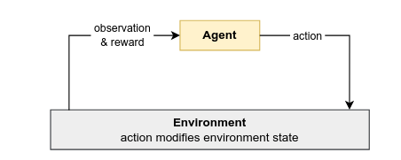
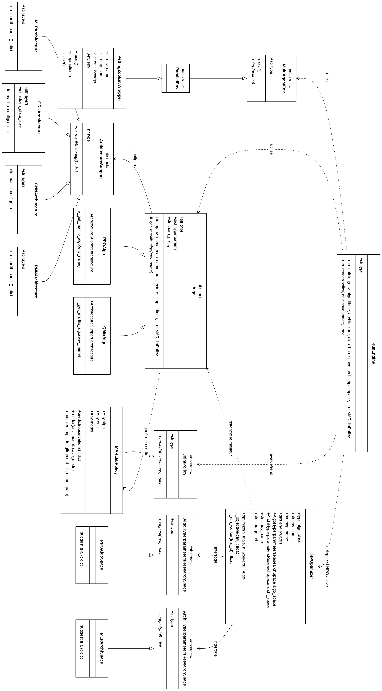
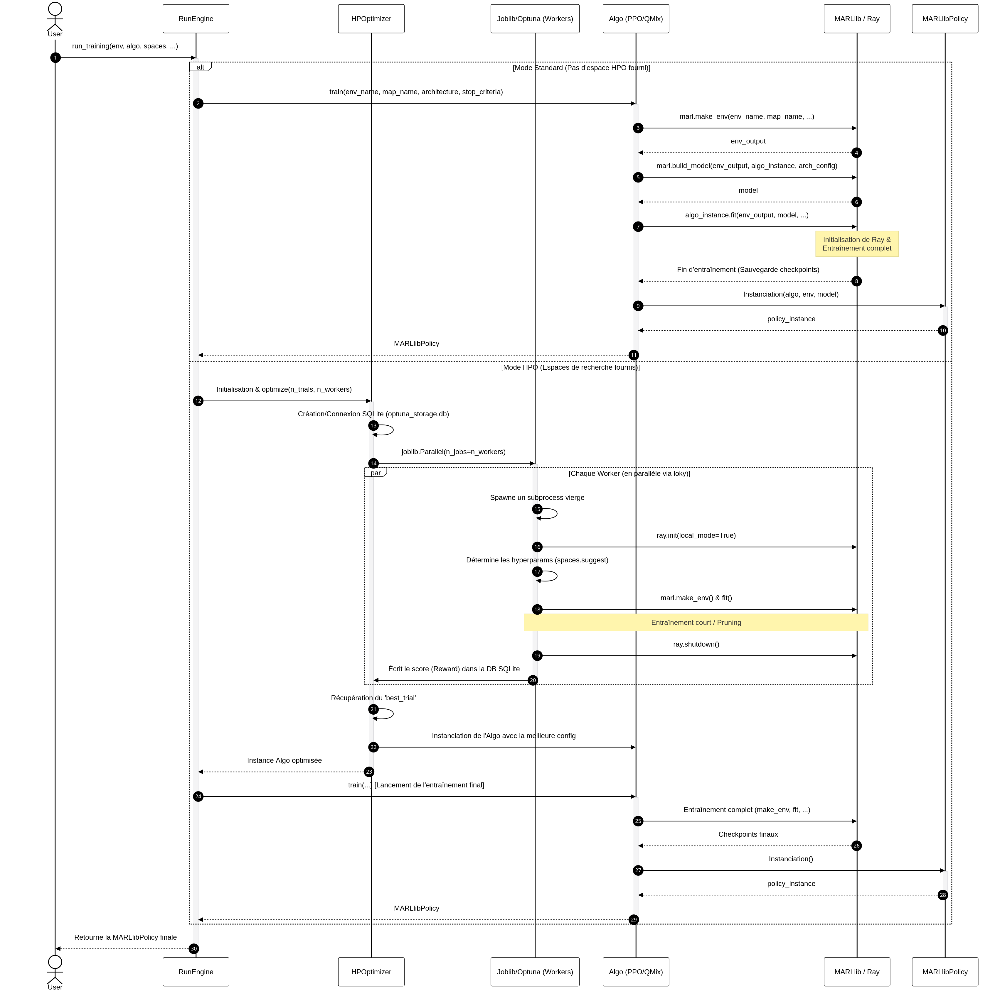
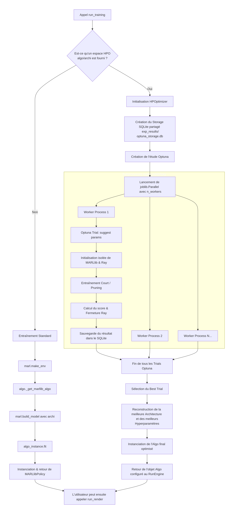
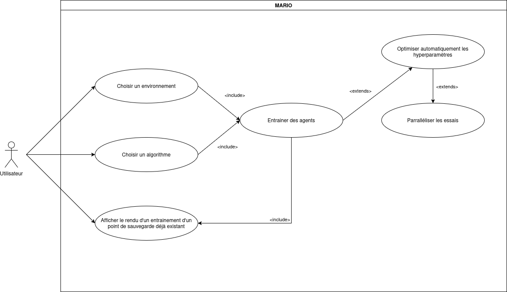

# Remerciements

Tout d'abord, nous tenons à remercier M. SOULÉ et M. JAMONT pour nous avoir encadré tout au long du projet.

Plus particulièrement, nous tenons à remercier M. SOULÉ pour nous avoir attribué une mission intéressante, valorisante et riche en apprentissage, ainsi que pour sa précieuse aide lorsque nous rencontrions des difficultés.

Faire ce projet parmi eux a été un plaisir, autant sur le plan professionnel que personnel, nous avons beaucoup appris, approfondi nos connaissances sur différentes technologies.

Enfin, nous tenons aussi à remercier M. PELLIER, Mme. LANDRY, pour leurs conseils et retours notamment lors des diverses réunions que l’on a pu avoir.

# Introduction

En 2013, un algorithme d’apprentissage par renforcement a été le premier à permettre à des agents de jouer à sept jeux Atari de manière aussi bonne que les meilleurs joueurs experts, voir les a surpassés dans trois jeux. Depuis 2021, l’apprentissage par renforcement s’est intéressé à un contexte multi-agents dans l’environnement, créant un sous-domaine où de nombreux défis restaient à relever. Aujourd’hui, le monde de l’apprentissage par renforcement multi-agents a beaucoup évolué dans le monde de la recherche, mais reste assez peu exposé à un public plus étendu en dehors de la communauté de recherche scientifique, une tâche que nous nous sommes fixés dans notre TER au travers d’un framework permettant l’utilisation d’apprentissage par renforcement multi-agents pour un plus grand public.

Les outils actuellement disponibles pour un usage plus grand public n’incluent pas une grande variété d'algorithmes et d'environnement quand c’est le cas. Le plus souvent, ils n'incluent aucun algorithmes d’apprentissage par renforcement (RL).
MARIO est un framework proposant une large intégration d'algorithmes basé sur des outils étant des standard du domaine et proposant une unification au sein d’une même librairie.

Ce document présente dans un premier temps les Connaissances fondamentales et le contexte de la problématique à laquelle essaye de répondre MARIO. Ensuite, une brève présentation du projet situera les tenant et aboutissant en passant par l’ensemble des outils utilisés, la documentation, l’organisation de l’équipe, l’application de MARIO à un scénario d’usage et une rétrospective du projet. 

# Connaissances fondamentales

Pour comprendre le contexte et les apports de MARIO, il est nécessaire de rappeler les fondamentaux du MARL et rappeler les concepts de base du domaine. Pour cela nous nous référerons sur le livre Multi-Agent reinforcement learning: Foundations and Modern Approaches.

## Les systèmes multi-agents

### L'importance de l'agent

*“Un agent est une entité recevant des informations à propos des états de l’environnement et qui peut choisir différentes actions pour influencer l’état de l’environnement. Les agents peuvent avoir des connaissances sur l'environnement, tels que les états possibles de l’environnement et comment ces états peuvent être affectés par les actions de l’agents. Il est important de noter que les agents sont guidés par un but et choisissent leurs actions pour atteindre ce dernier. [...] En MARL (Multi-Agent Reinforcment Learning), ce but est défini par une fonction de récompense qui spécifie un signal de récompense que les agents reçoivent après avoir exécuté certaines actions dans certains états. Le terme politique signifie une fonction qui, étant donné l’état courant de l'environnement, est utilisée par un agent pour sélectionner les actions (ou assigner des probabilités à la sélection de chaque action). [...]”* 

*“Un système multi-agent consiste en un environnement et plusieurs agents prenant des décisions et interagissant dans l’environnement pour atteindre un certain but.”* 

### L’importance de l’environnement

*“Un environnement est un mode physique ou virtuel dont l’état évolue en fonction du temps et est influencé par les actions des agents qui existent dans cet environnement. L’environnement spécifie les actions que les agents peuvent faire à tout moment et les observations que les individus (agents) reçoivent à propos de chaque état de l’environnement. Les états de l’environnement peuvent être définis discrètement ou en continu ou combinaison des deux [...]”* 

## Apprentissage par renforcement et apprentissage par renforcement multi-agents

*“Les algorithmes d’apprentissage par renforcement apprennent des solutions pour des décisions séquentielles à travers des interactions répétées avec l'environnement.”* 
*“Cette définition est cependant générale, pour bien la comprendre, il faut se poser les trois questions suivantes :*
*Qu’est-ce qu’un processus de décision séquentiel ?*
*Qu’est-ce qu’une solution au processus ?*
*Que veut dire l’apprentissage par interaction répété ?*

*Un processus de décision séquentiel se définit par un agent qui prend des décisions à travers de multiples états temporels dans un environnement pour atteindre un certain but. Dans chaque pas temporel, les agents reçoivent les observations de l’environnement et choisissent une action. [...] Étant donné une action choisie, l’environnement peut changer d’état en fonction de certaines dynamiques de transition et envoyer un signal de récompense à l’agent. [...]”*  **Figure 1**

*”Une solution à un processus de décision est une politique de décision optimale pour l’agent qui choisit des actions dans chaque état pour atteindre un certain objectif d’apprentissage. [...] Le retour dans un état, quand une politique donnée est suivie, est défini comme la somme des récompenses reçue au cours du temps de cet état et de ceux qui suivent. [...]”* 

*”Enfin, les algorithmes RL (Reinforcment Learning) apprennent, tel que la politique optimale, en essayant différentes actions dans différents états et en observant les résultats. Cette manière d’apprentissage est parfois décrite comme “l'essai/erreur” car les actions peuvent mener autant à des résultats positifs que négatifs, ces résultats qui sont inconnus au préalable et doivent donc être découverts en essayant des actions. Un problème central dans ce processus d’apprentissage, souvent appelé “le dilemme exploration-exploitation”, est comment équilibrer l'exploitation des résultats des différentes actions versus s’en tenir aux actions que l’on croit actuellement les meilleures. L’exploration pourrait découvrir de meilleures actions, mais résulter à de basses récompenses au cours du processus, alors que l'exploitation peut atteindre un certain niveau de retour, mais ne pas découvrir les actions optimales.”* 

L’apprentissage par renforcement multi-agents est composé de deux conceptions principales, d'abord les systèmes multi-agents qui seront définis dans un premier temps, ensuite, l’apprentissage par renforcement. Enfin, une définition de ce que sont les hyperparamètres et l’optimisation de ces derniers sera donnée en troisième partie de cette introduction. 

## Optimisation des hyperparamètres

La politique de l’agent est supportée par les réseaux de neurones qui sont entraînés via des algorithmes d’apprentissage par renforcement afin de mettre à jour leurs poids. Cependant, il y a plusieurs hyperparamètres qui sont réglés au préalable pour ensuite entraîner le model. Par exemple pour un réseau de neurones où le réseau est le modèle apprenant les hyper paramètre sont le nombre de neurones dans une couche, le nombre de couches, etc.

L’optimisation des hyperparamètres consiste à essayer plusieurs réglages des différents hyperparamètres différents pour trouver le réglage optimal. Autrement dit, il consiste à trouver un tuple1 d’hyperparamètre qui produit un modèle optimal qui minimise une fonction d’objectif prédéfinie sur des données de test définies (typiquement la récompense moyenne sur un ensemble d’épisodes de tests). Cette recherche par essai-erreur des hyperparamètres peut prendre beaucoup de temps au vu du très grand nombre de valeurs possibles que ces hyperparamètres peuvent prendre. De ce fait, pour trouver une combinaison satisfaite d’hyperparamètres, on peut restreindre la recherche à un espace de valeurs dont on sait par expérience qu’il est le plus pertinent. Par exemple, on sait qu’une fonction d’activation de type ReLU (Rectified Linear Unit, la fonction d’activation la plus utilisée dans les réseaux de neurones) est en général suffisante pour des applications RL.

# État de l’art

Le tableau suivant permet de mettre en évidence les manques spécifiques que la plateforme MARIO vise à combler, il présente un comparatif entre des plateformes existantes et celle de notre projet. 

\begin{center}
\begin{longtable}{|p{5cm}|c|c|c|c|c|}
\hline
\textbf{Critère / Plateformes} & \textbf{Gama} & \textbf{Netlogo} & \textbf{Cromas} & \textbf{Matlab} & \textbf{MARIO} \\ \hline
\endfirsthead
\hline
\textbf{Critère / Plateformes} & \textbf{Gama} & \textbf{Netlogo} & \textbf{Cromas} & \textbf{Matlab} & \textbf{MARIO} \\ \hline
\endhead
Configuration d'agent (RL) & [ ] & [ ] & [ ] & [x] & [x] \\ \hline
Agnostique aux langages & [ ] & [x] & [x] & [ ] & [x] \\ \hline
Documentation & bonne & bonne & moyenne & moyenne & bonne \\ \hline
Interface de visualisation & [x] & [x] & [x] & [x] & [x] \\ \hline
\end{longtable}
\end{center}

## Identifications des verrous (gaps) théorique et pratiques

Comme le montre le tableau ci-dessus peu sont les plateformes ou solutions existantes qui proposent une configuration de modèles d’apprentissage par renforcement et d’une utilisation simple et agnostique de tout environnement et algorithmes de RL ou de connaissances expertes avancées. Cela pose le problème suivant :

> Dans l’état actuel des outils disponibles pour entraîner et simuler des interactions de système multi-agents en apprentissage par renforcement il faut savoir maîtriser plusieurs librairies2 toutes avec leur spécificité et leur framework3 propre. Comment améliorer l’utilisabilité de ces librairies et rendre l’accessibilité du MARL le plus agnostique possible de connaissance des frameworks et connaissances expertes en RL ?

# Le projet MARIO

MARIO est une solution simplifiée et réunissant en une librairie les différentes librairies nécessaires pour réaliser un projet en MARL :
PettingZoo : Il s'agit du standard international pour les environnements multi-agents. Nous l'utilisons pour garantir une interopérabilité totale, permettant de passer d'une simulation à une autre sans modifier la structure de communication entre les agents.
MARLlib (Le moteur d'algorithmes) : Ce framework fournit la base algorithmique. Sa maturité et sa richesse en algorithmes MARL éprouvés en font le socle idéal pour traiter des cas d'usage complexes là où d'autres librairies (comme, plus anciennement utilisées, Stable-Baselines3 ou TorchRL) se montrent plus limitées.
Optuna (L'optimisation) : Issu de la recherche académique, Optuna est aujourd'hui l'état de l'art pour l'optimisation des Hyperparamètres (HPO). Il automatise le réglage fin des modèles, rendant la configuration performante accessible sans nécessiter une expertise manuelle approfondie. 

Cette solution met à disposition une librairie, une interface en ligne de commande et une interface graphique permettant de rapidement et facilement expérimenter un système multi-agents en apprentissage par renforcement. L’interface graphique étant le plus abordable, le but est de proposer un modèle de simplification de l’utilisabilité des librairies du MARL.

Étant donné que MARIO se base sur la librairie MARLlib, qui est une libraire assez généraliste en regroupant une vaste variété d’algorithmes et d’environnement pour le MARL, il donne accès à l’utilisateur, par extension, à cette grande variété d’algorithmes et d’environnements.

Enfin, ce logiciel propose une automatisation des différentes étapes de l’optimisation d’hyperparamètres et du processus d’entrainement. En effet, il suffit de fournir les réglages voulus pour un algorithme et environnement choisi, pour que MARIO puisse construire un modèle et chercher la configuration d’hyperparamètre optimale automatiquement.

# Documentation

## Conception du projet 

Plusieurs documents ont été réalisés lors de la phase de conception et mis à jour pour suivre l'évolution de MARIO (disponibles en annexe). Le diagramme de cas d'utilisation présente les fonctionnalités offertes à l'utilisateur (entraînement, optimisation HPO, rendu), le diagramme de classes détaille la structure et l'organisation logique du code, et le diagramme de séquence illustre la chronologie des appels de fonctions lors d'une session d'apprentissage. 

## Documentation du code

Afin d'assurer la pérennité du code et de faciliter son appropriation par d'autres utilisateurs, une documentation a été intégrée directement au cœur du développement. Cette approche repose sur deux type de documentation 

## Commentaires du code : 

Les classes et méthodes implémentées dans le cadre de MARIO sont commentées pour faciliter la compréhension des paramètres, des retours attendus et du comportement des méthodes, assurant ainsi une maintenance facilitée et une réduction significative de la dette technique.

## Documentation avec Pdoc

Pdoc est un support de création permettant de générer la documentation d’API en se basant sur sa rédaction dans le code, ce qui permet à la fois d’avoir les explications une fois compilée, mais aussi au sein même du code pour les développeurs. 

Nous avons donc mis en place un système de génération de documentation via Pdoc. Cet outil compile dynamiquement les docstrings4 présents dans le code source pour produire une interface web navigable et intuitive. Cette documentation en ligne permet aux utilisateurs d'explorer l'arborescence du projet, de consulter les signatures des fonctions et de comprendre l'architecture du framework sans avoir à parcourir les fichiers sources manuellement. 	

## Guide d’installation

Le document Readme.md disponible dans le dépôt GitHub5 du projet, ce guide fournit les indications à effectuer afin qu’un développeur puisse installer le projet sur sa machine et poursuivre son développement facilement.

# Organisation du projet

Nous avons organisé nos sessions de travail de manière hybride, c'est-à-dire tant en distanciel (depuis chez nous) que sur place (Au sein du bâtiment Michel Dubois).

## Gestion de version avec Git

Git est un outil de gestion de versions largement utilisé dans le développement logiciel. Il permet de suivre l’historique des modifications du code source afin de collaborer efficacement entre plusieurs développeurs et de garantir une meilleure qualité du projet.
### Développement des fonctionnalités
Dans le cadre du développement, chaque nouvelle fonctionnalité ou correction est réalisée sur une branche dédiée (dont les tâches associées sont attribuées à une personne). Cette approche permet d’isoler les changements, de limiter les conflits et de faciliter les revues de code avant leur intégration dans la branche principale.
### Convention de nommage des commits
Une convention de nommage des commits est également mise en place afin d’améliorer la traçabilité des modifications. Chaque commit décrit clairement la nature du changement effectué (ajout de fonctionnalité, correction de bug, amélioration, documentation, etc.), ce qui facilite le suivi de l’évolution du projet.
### Validation automatique
Avant toute fusion de code via un Pull Request (PR)6, un pipeline d’intégration continue est exécutée automatiquement. Ce pipeline a pour but de vérifier la conformité de l’architecture de MARIO et l’absence d’erreurs bloquantes. Cette étape permet de détecter rapidement les problèmes potentiels et d'assurer la stabilité du code intégré.
### Validation mutuelle
Avant toute fusion de code via une Pull Request (PR), le membre de l’équipe qui n’est pas le principal contributeur de la branche complète le processus de validation en assurant la validité des modifications effectuées.
### Backlog

À partir des issues* créées en fonction des différentes tâches à effectuer et à l’aide de l’outil “Projects” intégré à GitHub, un kanban de tâches7 a été mis en place. Ce dernier a pour but de pouvoir retracer en temps réels les tâches à faire ainsi que leur état de progression.

## Communication avec le tuteur
Des réunions ont été régulièrement organisées (approximativement 1 semaine) avec M. SOULÉ afin de faire un bilan sur la progression du projet. Cela nous a permis de continuellement nous assurer que le projet avançait dans la bonne direction. Par ailleurs, en cas de nécessité, nous avons aussi pu contacter notre tuteur en cas de blocage notamment sur le plan technique.

# Application de MARIO à un scénario

Pour appréhender l'intérêt de la librairie MARIO, imaginons un chercheur souhaitant entraîner une équipe d'agents à coopérer pour encercler un adversaire dans un scénario Multi-Agent Particle (MPE) de PettingZoo. Traditionnellement, cette tâche exigerait la rédaction de scripts de configuration complexe et une gestion fastidieuse des conflits de processus liés à l'initialisation de Ray. MARIO résout ces frictions en encapsulant l'écosystème MARLlib sous une interface unifiée.

## La librairie MARIO

Les contributions principales de MARIO portent sur des améliorations concernant l’utilisabilité, la généricité et l’automatisation des processus pour l'expérimentation de systèmes MARL.

## Les différents modules intégrés

L’amélioration de l’utilisabilité apportée par MARIO, l'objectif initial nous semble largement atteint : l'utilisateur n'a besoin d'assembler que quelques objets Python, un environnement, un algorithme, une architecture puis d’utiliser une unique méthode, run_training(), pour déclencher l'ensemble du processus d'apprentissage par renforcement, sans avoir à connaître le fonctionnement interne de MARLlib ni la structure de ses fichiers de configuration. Le module de rendu pousse cette logique plus loin en retrouvant de lui-même la session d’entrainement la plus récente et son meilleur point de sauvegarde, évitant ainsi à l'utilisateur de naviguer manuellement dans l'arborescence de résultats générée par Ray Tune (Librairie permettant aux agents de MARL d’effectuer leur apprentissage).

Concernant l'automatisation, RunEngine enchaîne automatiquement la création de l'environnement, l'instanciation de l'algorithme et la construction du modèle avant de lancer l'entraînement, tandis que HPOptimizer automatise entièrement la recherche d'hyperparamètres : chaque essai est exécuté dans un sous-processus isolé, la synchronisation entre essais parallèles est assurée par un stockage SQLite partagé permettant la reprise après interruption, et le score de chaque essai est lu et reporté automatiquement à partir des fichiers de résultats générés par MARLlib. Ainsi, une recherche d'hyperparamètres qui nécessiterait normalement de lancer manuellement des entraînements, de comparer leurs performances et de sélectionner le bon point de sauvegarde se réduit à un appel à la méthode optimize().

Pour ce qui est de la généricité, MARIO repose sur trois hiérarchies de classes abstraites indépendantes, une pour les environnements, une pour les algorithmes et leurs architectures, une pour les espaces de recherche d'hyperparamètres, celles-ci sont conçues pour être étendues par simple héritage sans modifier le moteur. Cette conception permet en théorie d'intégrer de nouveaux algorithmes, environnements ou types de réseaux de neurones sans toucher à RunEngine ou à HPOptimizer , qui n'interagissent qu'au travers de ces interfaces. Cette généricité reste cependant à ce stade davantage structurelle qu'exploitée : seul l'environnement PettingZoo a été implémenté, et pour l’instant seuls mappo et qmix sont disponibles parmi l'ensemble des algorithmes que propose MARLlib. 

## Ajouts et Changements

Durant la planification, il était prévu d’implémenter l’environnement Overcooked basé sur le jeu du même nom. Cependant. Il était plus commode de commencer par un environnement plus simple telle que “simple world comm” de mpe.
Il s’agit d’un environnement présentant un scénario proie-prédateur où les prédateurs ont un prédateur leader qui voit les proie à tout moment. Il y a aussi des obstacles telle que des forêts dans lesquelles les parois peuvent se cacher et dès montagne derrière laquelle elles peuvent se cacher aussi. Il y a également de la nourriture pour les proie qui ont besoin de regagner des points de vie. Enfin, les règle sont les suivantes : si un prédateur touche une proie cette dernière perds des points de vie et le prédateur reçoit des points de récompense. Si la proie mange touche la nourriture elle gagne de la vie. Les prédateurs simples ne voient les proies qu’en dehors des forêts et des angles morts de montagne. Le prédateur leader quant à lui envoie des indications de position des proies aux prédateurs simples.

Il a aussi été possible d’ajouter l'environnement lbf ou les agents ont pour but de collecter des ressources dans un monde représenté en grille. Les agents peuvent coopérer ou être en compétition pour la récolte des ressources.
Également en plus de l’algorithme mappo prévu initialement l’algorithme qmix est utilisable. Ce dernier est un algorithme de multi-agent reinforcement learning coopératif qui apprend une fonction de valeur globale Qtot​ en combinant de manière monotone les fonctions de valeur locales de chaque agent, permettant un entraînement centralisé tout en conservant une exécution décentralisée.
   

# Rétrospective et biais

## Choix des technologies

Dans le cadre de MARIO, nous avons choisi d’utiliser la librairie MARLlib, car elle s’appuie sur l’écosystème PettingZoo. Cette interface, largement reconnue dans la communauté pour sa standardisation, propose une variété d'environnements multi-agents parfaitement alignés sur nos objectifs. De plus, la maturité de MARLlib et la possibilité d’être accompagnés par notre tuteur sur cet outil spécifique justifient notre choix.

Cependant, l’utilisation de MARLlib a relevé des limites notables. Étant une librairie mature, elle repose sur des versions de Python maintenant anciennes, ce fait a engendré beaucoup de conflits de dépendances. Ces “combats contre les versions” ont représenté une charge de maintenance importante et difficile à prévoir. Cela nous questionne aussi sur la viabilité du framework à long terme, bien que les problèmes rencontrés aient été résolus, il pourrait y en avoir d’autres qui entreraient en conflits avec ce qui a déjà été implémenté.

Face à ces contraintes, nous avons étudié des alternatives plus modernes comme JaxMARL, une librairie plus récente. Cette solution présente l'avantage d'une exécution nettement plus rapide, idéale pour les simulations intensives. Toutefois, après analyse, il est apparu que son utilisation impliquait de transformer l'intégralité de nos environnements en espaces vectoriels. La réadaptation nécessaire des algorithmes pour assurer cette compatibilité représentait une charge de travail trop conséquente au regard de nos délais, sans compter le temps de montée en compétence requis sur cette technologie émergente. 

En dépit de tout cela, l’automatisation de l’optimisation des hyper paramètres s’est montrée moins complexe que prévu initialement. Cette automatisation, en plus de la facilitation du choix d’algorithmes et d’environnement, représente un point clef dans la valeur ajoutée de notre projet.

## Organisation

En ce qui concerne l’organisation de notre projet, il est tout d’abord notable qu’en raison de la montée en compétence nécessaire à la réalisation d’un projet de MARL tel que MARIO, nous avons dû faire un mini-projet (consistant à manipuler la librairie MARLlib et analyser son fonctionnement). 

D’autres difficultés rencontrées ont impacté le bon déroulement du projet, notamment  le départ de M. Raphoz du projet, les “combats contre les versions” précédemment mentionnés ainsi qu’un effet de tunnel sur certaines méthodes comme la fonction de prédiction.

## Perspectives
D’autre part, le projet présente des perspectives d’évolution variées, distinguant les améliorations à court terme, d'ores et déjà planifiées, des axes de développement futurs, qui constituent des opportunités d’enrichissement notables :

Une interface CLI8 (Command Line Interface) s’appuyant sur ArgParse, le module standard de python pour créer des interface CLI, proposant une utilisation facilitée de la librairie MARIO.
Une interface GUI9 (Graphical User Interface), permettant l’utilisation des mêmes fonctionnalités, une utilisation probablement plus lente qu’une interface CLI pour une personne initiée, mais une visualisation de l’interface et un rendu du résultat des entrainements plus agréables.

Le développement de ces deux interfaces sont les deux prochaines étapes du déroulement logique de notre projet, puisqu’elles répondent directement à l’objectif de la librairie MARIO, à savoir rendre l’utilisation de MARL la plus agnostique de connaissance possible.

Ensuite, l’ajout d’autres algorithmes et environnements semble être une suite logique pour compléter ces interfaces, en effet, diversifier les possibilités de choix pour les utilisateurs potentiels ne peut que rendre plus attrayant la librairie MARIO pour ses utilisateurs potentiels.

Enfin, l’établissement de ce projet en tant que projet Open-Source pourrait être une optique intéressante, afin de démocratiser l’accès au MARL et d'abaisser les barrières techniques pour les chercheurs et développeurs souhaitant intégrer rapidement des environnements hétérogènes. 

# Conclusion

MARIO répond au manque d'outils accessibles pour expérimenter le MARL en dehors de la communauté de recherche, en unifiant PettingZoo, MARLlib et Optuna derrière une interface centralisée autour du RunEngine. L'application ayant des scénarios concrets (MPE, lbf, mappo, qmix) a validé cette abstraction : ce qui demanderait normalement des scripts de configuration complexes se réduit à l'assemblage de quelques objets Python. Le parcours n'a pas été sans encombre, notamment des conflits de dépendances liés à la maturité de MARLlib, mais l'automatisation de l’optimisation des hyperparamètres s'est révélée plus simple que prévue et reste l'un des apports les plus solides du projet.
Ce projet de MARL nous aura appris beaucoup sur l'apprentissage par renforcement, et reste, au-delà du domaine lui-même, complet dans sa conception, son organisation et ses objectifs concrets, ce qui nous a permis d'acquérir une expérience concrète d'application de notre cursus universitaire.
Sur l'utilisabilité, l'objectif est largement atteint grâce à une API réduite à quelques objets mais aucune interface CLI/GUI n'existe encore. Sur la généricité, l'architecture en hiérarchies abstraites ouvre la voie à de nombreuses extensions, mais reste pour l'instant plus structurelle qu’exploitée (seuls les environnements mpe et lbf et seuls les algorithmes d’entrainement mappo et qmix). Sur l'automatisation, en revanche, MARIO atteint les objectifs, avec un enchaînement entièrement automatisé de l'entraînement et d’optimisation des hyperparamètres. Ces limites tracent les perspectives naturelles : interfaces CLI puis GUI, élargissement du catalogue d'algorithmes et d'environnements, et passage en Open-Source à plus long terme.
Bien que ce projet comporte des axes d'amélioration, l'objectif principal de généraliser MARLlib pour rendre le MARL plus accessible semble atteint.

# Bibliographie

Albrecht, S. V., Christianos, F., & Schäfer, L. (2024). Multi-Agent reinforcement learning: Foundations and Modern Approaches. (consulté le 17 juin 2026).

Git : convention de nommage pour des commits parfaits – Buzut. (n.d.). Retrieved June 17, 2026, from https://buzut.net/cours/versioning-avec-git/bien-nommer-ses-commits.

JaxMARL: Multi-Agent RL Environments and Algorithms in JAX. (2024). Retrieved June 17, 2026, from https://arxiv.org/html/2311.10090v5.

Mnih, V., Kavukcuoglu, K., Silver, D., Graves, A., Antonoglou, I., Wierstra, D., & Riedmiller, M. (2013, December 19). Playing Atari with Deep Reinforcement Learning. arXiv.org. Retrieved June 17 2026, from https://arxiv.org/abs/1312.5602.

PettingZoo documentation. (n.d.). Retrieved June 15, 2026, from https://pettingzoo.farama.org/index.html. 

pdoc – Generate API Documentation for Python Projects. (n.d.). Retrieved June 17, 2026, from https://pdoc.dev/

PyTorch. (n.d.). PyTorch. Retrieved June 17, 2026, from https://pytorch.org/

Replicable-Marl. (n.d.). GitHub - Replicable-MARL/MARLlib: One repository is all that is necessary for Multi-agent Reinforcement Learning (MARL). GitHub. Retrieved June 15, 2026, from https://github.com/Replicable-MARL/MARLlib

Soulé, J. (n.d.). GitHub - julien6/MOISE-MARL: MOISE+MARL is an organizationally-guided framework designed to enhance control and explainability in Multi-Agent Reinforcement Learning (MARL) by structuring agents’ behaviors through predefined roles and missions. GitHub. Retrieved June 14, 2026, from https://github.com/julien6/MOISE-MARL 

# Glossaires

tuple1 : Structure de données immuable (non modifiable) en Python permettant de stocker une séquence ordonnée d'éléments. 

librairies2 : Ensemble de codes et de fonctions pré-écrits que l'on intègre à un programme pour étendre ses fonctionnalités sans tout redévelopper. 

framework3 : Cadre de travail structuré fournissant une base logicielle solide et des outils pour développer des applications complexes de manière standardisée. 

docstrings4 : Commentaires placés dans le code source (généralement entre triples guillemets) qui documentent automatiquement le rôle des fonctions, classes ou modules. 

GitHub5 : Plateforme de développement collaboratif utilisant Git pour héberger, gérer le versionnage du code et faciliter le travail en équipe. 

Pull Request (PR)6 : Mécanisme sur GitHub permettant de proposer des modifications au code source d'un projet pour qu'elles soient revues, discutées puis intégrées par les responsables. 

kanban de tâches7 : Outil de gestion visuelle (sous forme de colonnes : “À faire”, “En cours”, “En revue” “Terminé”) permettant de suivre l'avancement et le flux de travail d'un projet. 

interface CLI8 : Interface textuelle où l'utilisateur interagit avec le logiciel en tapant des commandes dans un terminal. 

interface GUI9 : Interface visuelle permettant d'interagir avec le logiciel via des éléments graphiques (fenêtres, boutons, menus) manipulés à la souris. 

# Annexes

## Diagramme de Classe V3 :

{width=100%}

## Diagramme de séquence V2

{width=100% hight=60%}

## Diagramme de flux 

{width=100%}

## Diagrame de cas d'usage

{width=100%}