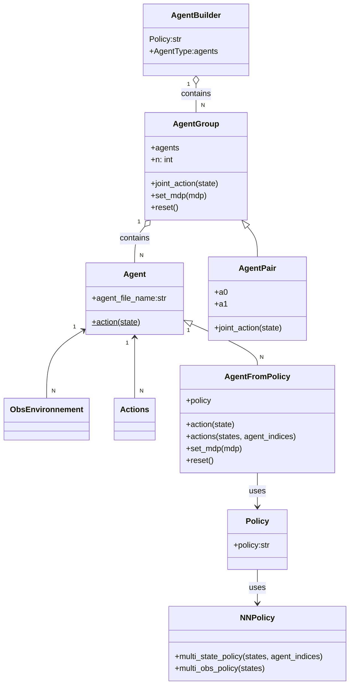

```mermaid
classDiagram
    class Agent {
        +agent_file_name:str
        +action(state)$
    }

    class AgentGroup{
        +agents
        +n: int
        +joint_action(state)
        +set_mdp(mdp)
        +reset()
    }

    class AgentPair{
        +a0
        +a1
        +joint_action(state)
    }

    class Policy{
        +policy:str
    }

    class NNPolicy {
        +multi_state_policy(states, agent_indices)
        +multi_obs_policy(states)
    }

    class ObsEnvironnement{

    }

    class Actions{

    }

    class AgentBuilder{
        Policy:str
        +AgentType:agents

    }

    class AgentFromPolicy {
        +policy
        +action(state)
        +actions(states, agent_indices)
        +set_mdp(mdp)
        +reset()
    }

    AgentGroup <|-- AgentPair

    AgentGroup "1" o-- "N" Agent : contains

    AgentBuilder "1" o-- "N" AgentGroup : contains

    AgentFromPolicy --> Policy : uses

    Policy --> NNPolicy : uses

    Agent "1" <|-- "N" AgentFromPolicy

    Agent "1" <-- "N" ObsEnvironnement

    Agent "1" <-- "N" Actions

```