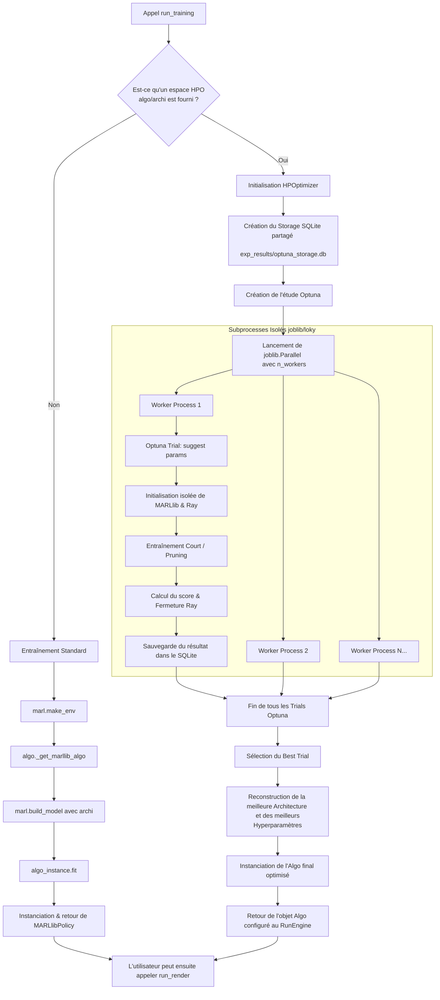

```mermaid
graph TD
    A[Appel run_training] --> B{Est-ce qu'un espace HPO <br> algo/archi est fourni ?}
    
    %% Branche Entraînement Standard
    B -- Non --> C[Entraînement Standard]
    C --> C1[marl.make_env]
    C1 --> C2[algo._get_marllib_algo]
    C2 --> C3[marl.build_model avec archi]
    C3 --> C4[algo_instance.fit]
    C4 --> C5[Instanciation & retour de MARLlibPolicy]
    
    %% Branche HPO
    B -- Oui --> D[Initialisation HPOptimizer]
    D --> D1[Création du Storage SQLite partagé <br> exp_results/optuna_storage.db]
    D1 --> D2[Création de l'étude Optuna]
    D2 --> E[Lancement de joblib.Parallel <br> avec n_workers]
    
    %% Parallélisation
    subgraph "Subprocesses Isolés joblib/loky"
        E --> F1[Worker Process 1]
        E --> F2[Worker Process 2]
        E --> F3[Worker Process N...]
        
        F1 --> G1[Optuna Trial: suggest params]
        G1 --> H1[Initialisation isolée de MARLlib & Ray]
        H1 --> I1[Entraînement Court / Pruning]
        I1 --> J1[Calcul du score & Fermeture Ray]
        J1 --> K1[Sauvegarde du résultat dans le SQLite]
    end
    
    %% Fin de l'optimisation
    K1 --> L[Fin de tous les Trials Optuna]
    F2 --> L
    F3 --> L
    
    L --> M[Sélection du Best Trial]
    M --> N[Reconstruction de la meilleure Architecture <br> et des meilleurs Hyperparamètres]
    N --> O[Instanciation de l'Algo final optimisé]
    O --> P[Retour de l'objet Algo configuré au RunEngine]
    
    %% Suite Logique
    P5[L'utilisateur peut ensuite appeler run_render]
    C5 --> P5
    P --> P5
```