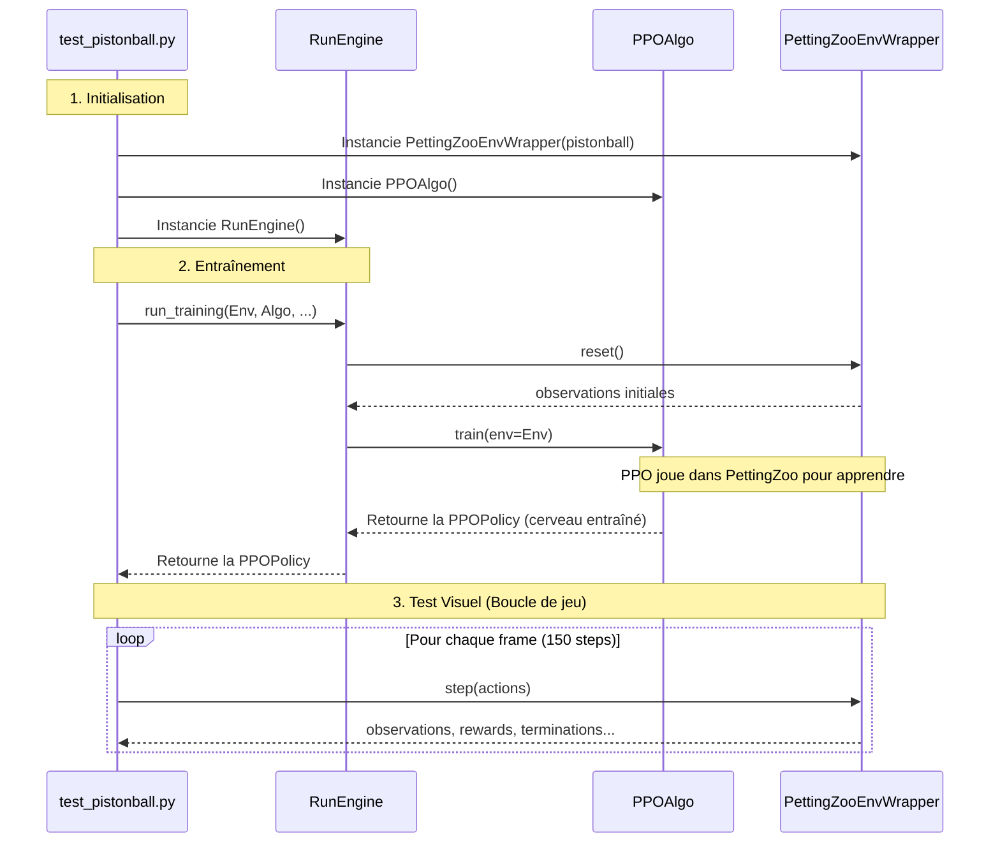

```mermaid
sequenceDiagram
    participant Script as test_pistonball.py
    participant Engine as RunEngine
    participant Algo as PPOAlgo
    participant Env as PettingZooEnvWrapper

    Note over Script: 1. Initialisation
    Script->>Env: Instancie PettingZooEnvWrapper(pistonball)
    Script->>Algo: Instancie PPOAlgo()
    Script->>Engine: Instancie RunEngine()

    Note over Script, Engine: 2. Entraînement
    Script->>Engine: run_training(Env, Algo, ...)
    
    Engine->>Env: reset()
    Env-->>Engine: observations initiales
    
    Engine->>Algo: train(env=Env)
    Note over Algo, Env: PPO joue dans PettingZoo pour apprendre
    Algo-->>Engine: Retourne la PPOPolicy (cerveau entraîné)
    
    Engine-->>Script: Retourne la PPOPolicy
    
    Note over Script, Env: 3. Test Visuel (Boucle de jeu)
    loop Pour chaque frame (150 steps)
        Script->>Env: step(actions)
        Env-->>Script: observations, rewards, terminations...
    end
```