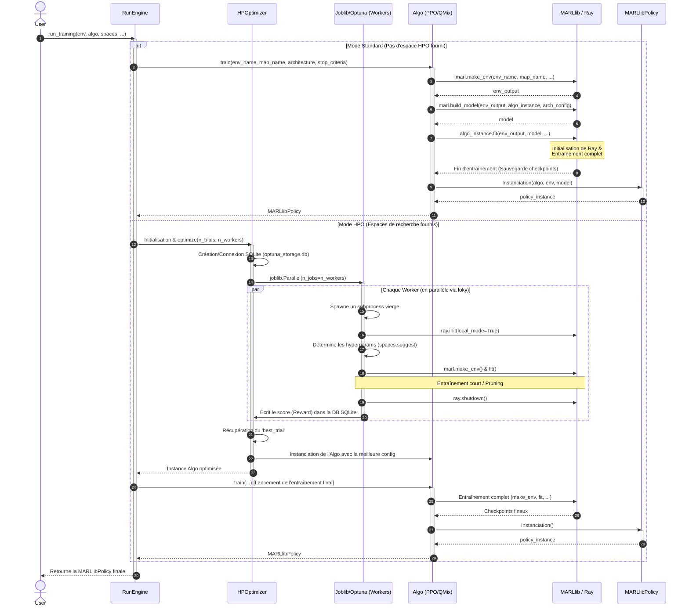

```mermaid
sequenceDiagram
    autonumber
    actor User
    participant RE as RunEngine
    participant HPO as HPOptimizer
    participant OJ as Joblib/Optuna (Workers)
    participant AL as Algo (PPO/QMix)
    participant ML as MARLlib / Ray
    participant PO as MARLlibPolicy

    User->>RE: run_training(env, algo, spaces, ...)
    activate RE
    
    alt Mode Standard (Pas d'espace HPO fourni)
        RE->>AL: train(env_name, map_name, architecture, stop_criteria)
        activate AL
        AL->>ML: marl.make_env(env_name, map_name, ...)
        ML-->>AL: env_output
        AL->>ML: marl.build_model(env_output, algo_instance, arch_config)
        ML-->>AL: model
        AL->>ML: algo_instance.fit(env_output, model, ...)
        Note over ML: Initialisation de Ray &<br>Entraînement complet
        ML-->>AL: Fin d'entraînement (Sauvegarde checkpoints)
        AL->>PO: Instanciation(algo, env, model)
        activate PO
        PO-->>AL: policy_instance
        deactivate PO
        AL-->>RE: MARLlibPolicy
        deactivate AL
        
    else Mode HPO (Espaces de recherche fournis)
        RE->>HPO: Initialisation & optimize(n_trials, n_workers)
        activate HPO
        HPO->>HPO: Création/Connexion SQLite (optuna_storage.db)
        HPO->>OJ: joblib.Parallel(n_jobs=n_workers)
        activate OJ
        
        par Chaque Worker (en parallèle via loky)
            OJ->>OJ: Spawne un subprocess vierge
            OJ->>ML: ray.init(local_mode=True)
            OJ->>OJ: Détermine les hyperparams (spaces.suggest)
            OJ->>ML: marl.make_env() & fit()
            Note over OJ,ML: Entraînement court / Pruning
            OJ->>ML: ray.shutdown()
            OJ->>HPO: Écrit le score (Reward) dans la DB SQLite
        end
        deactivate OJ
        
        HPO->>HPO: Récupération du 'best_trial'
        HPO->>AL: Instanciation de l'Algo avec la meilleure config
        HPO-->>RE: Instance Algo optimisée
        deactivate HPO
        
        %% Phase finale post-HPO
        RE->>AL: train(...) [Lancement de l'entraînement final]
        activate AL
        AL->>ML: Entraînement complet (make_env, fit, ...)
        ML-->>AL: Checkpoints finaux
        AL->>PO: Instanciation()
        activate PO
        PO-->>AL: policy_instance
        deactivate PO
        AL-->>RE: MARLlibPolicy
        deactivate AL
    end
    
    RE-->>User: Retourne la MARLlibPolicy finale
    deactivate RE
```