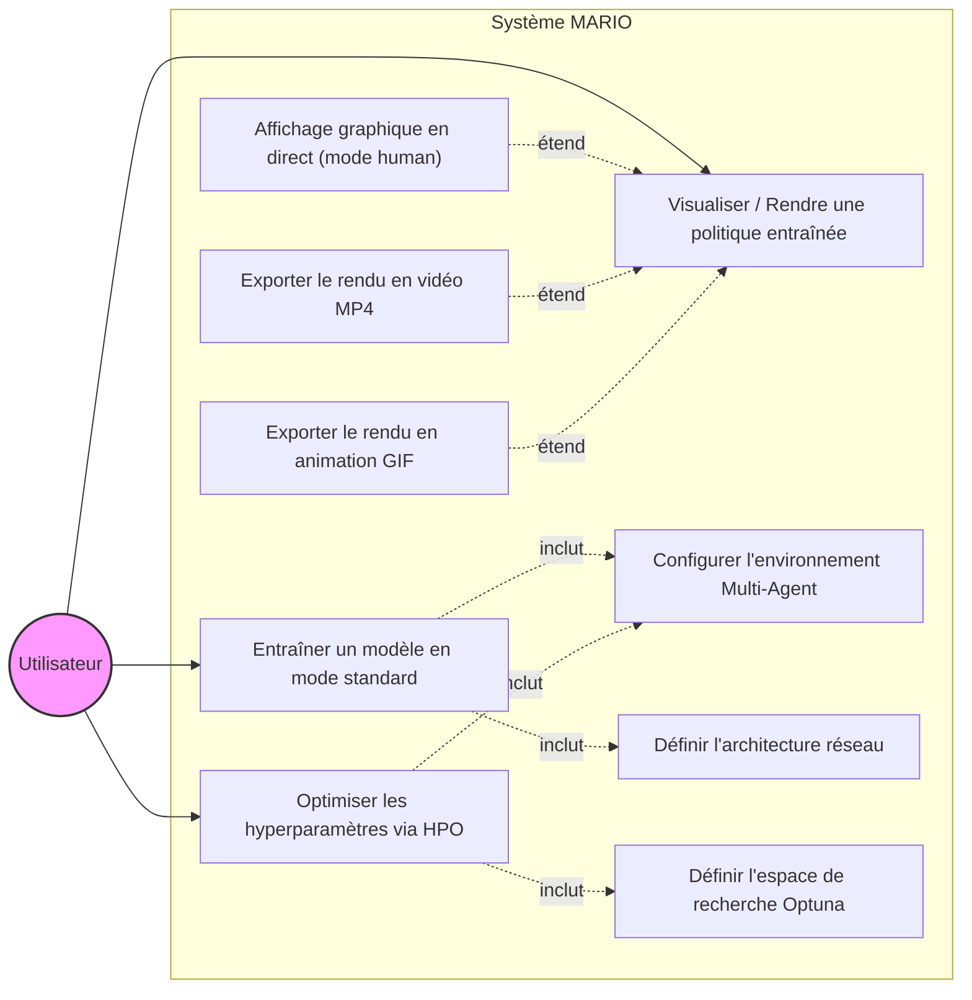

```mermaid
graph LR
    %% Définition de l'acteur principal
    Utilisateur((Utilisateur))

    subgraph Systeme_MARIO ["Système MARIO"]
        %% Cas d'utilisation principaux
        UC_Standard["Entraîner un modèle en mode standard"]
        UC_HPO["Optimiser les hyperparamètres via HPO"]
        UC_Render["Visualiser / Rendre une politique entraînée"]
        
        %% Cas d'utilisation secondaires
        UC_Config_Env["Configurer l'environnement Multi-Agent"]
        UC_Config_Archi["Définir l'architecture réseau"]
        UC_Def_Spaces["Définir l'espace de recherche Optuna"]
        
        UC_Live["Affichage graphique en direct (mode human)"]
        UC_Video["Exporter le rendu en vidéo MP4"]
        UC_GIF["Exporter le rendu en animation GIF"]
    end

    %% Relations acteur -> cas d'utilisation
    Utilisateur --> UC_Standard
    Utilisateur --> UC_HPO
    Utilisateur --> UC_Render

    %% Relations d'inclusion (dépendances requises)
    UC_Standard -.->|inclut| UC_Config_Env
    UC_Standard -.->|inclut| UC_Config_Archi
    
    UC_HPO -.->|inclut| UC_Config_Env
    UC_HPO -.->|inclut| UC_Def_Spaces

    %% Relations d'extension (options de rendu)
    UC_Live -.->|étend| UC_Render
    UC_Video -.->|étend| UC_Render
    UC_GIF -.->|étend| UC_Render

    %% Style
    style Utilisateur fill:#f9f,stroke:#333,stroke-width:2px;
```